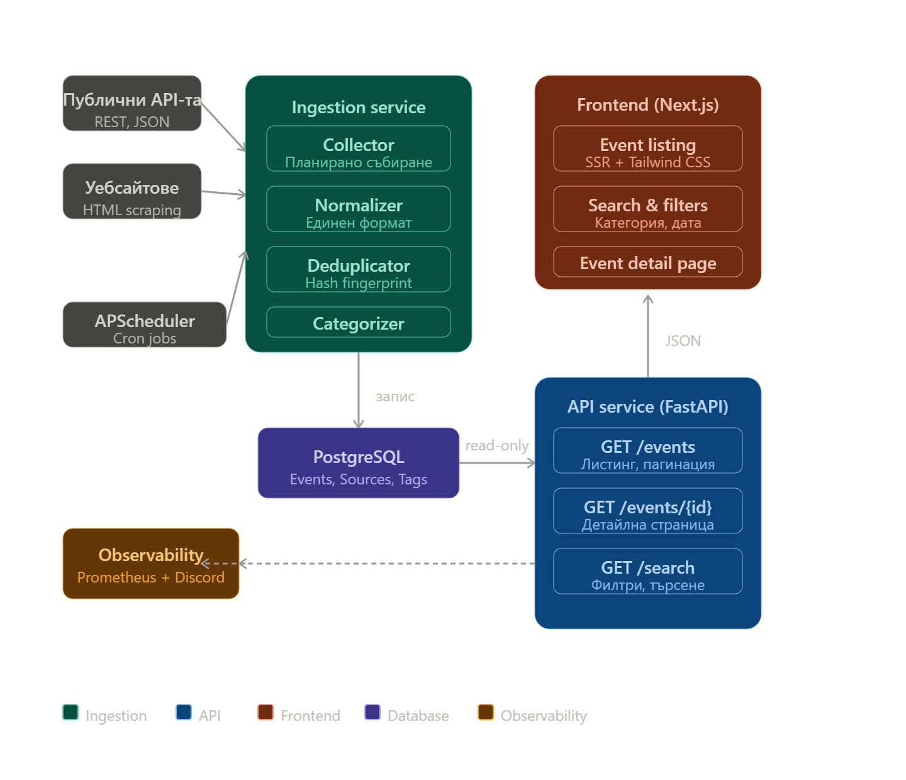
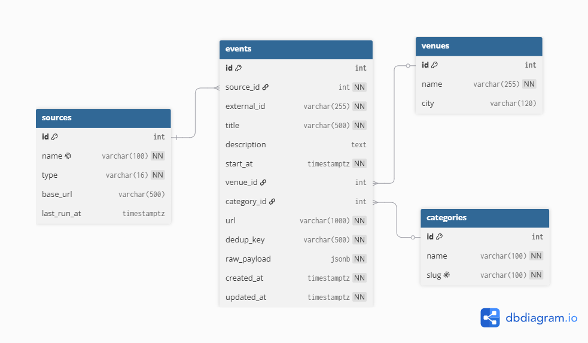
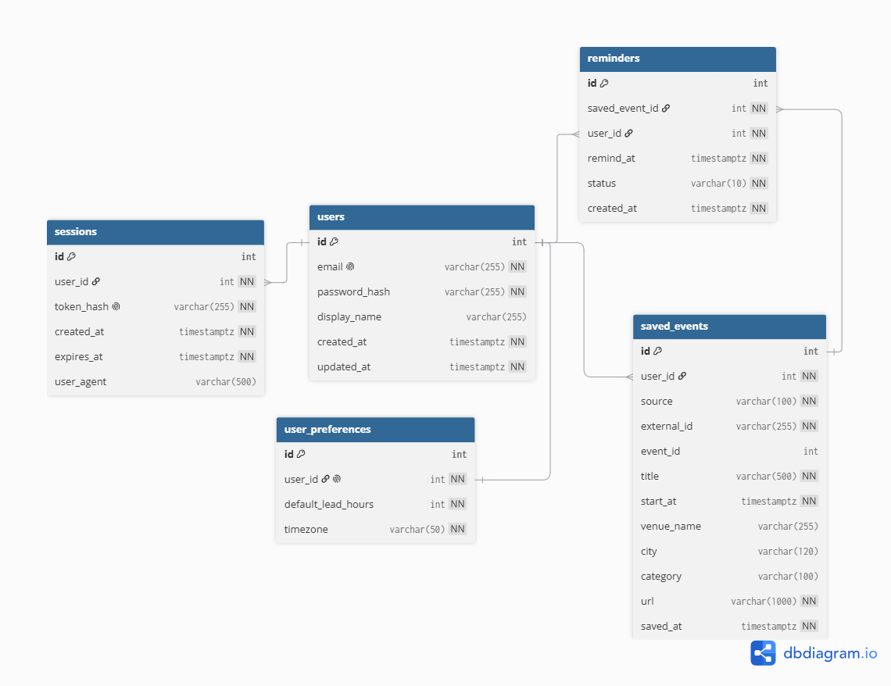
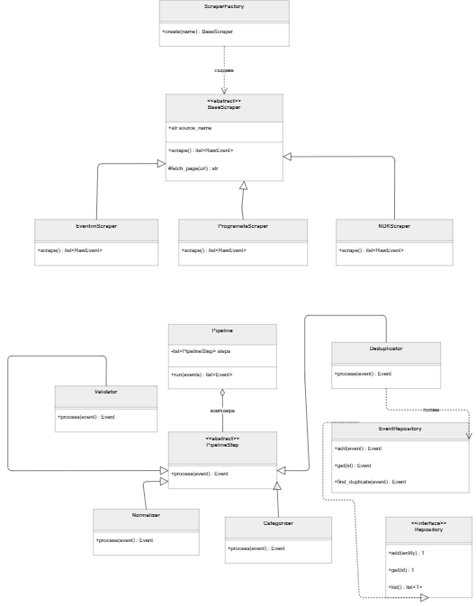
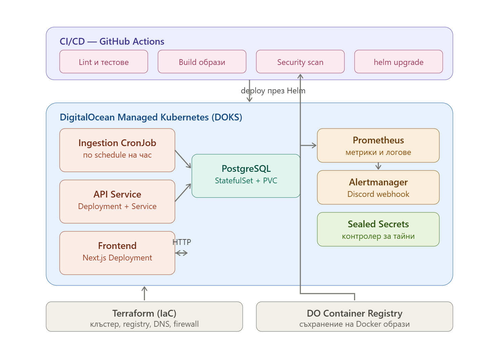

# EventHub – Платформа за търсене на събития

**Проектна документация по Проектно-базирано Обучение (ПБО) – Проект № 2**

---


**Екип:**
- Петър 
- Стоян 
- Дерин 


---

## Съдържание

1. [Увод](#увод)
2. [Глава 1 – Анализ и проучване](#глава-1--анализ-и-проучване)
   - 1.1 Предметна област и целева аудитория
   - 1.2 Преглед на съществуващи решения
   - 1.3 Аргументация на избор на технологии
3. [Глава 2 – Проектиране](#глава-2--проектиране)
   - 2.1 Функционални изисквания
   - 2.2 Нефункционални изисквания
   - 2.3 Архитектура на системата
   - 2.4 Инфраструктурна диаграма
   - 2.5 Схема на базата данни (ER диаграма)
   - 2.6 UML класови диаграми
   - 2.7 UI дизайн
4. [Глава 3 – Реализация](#глава-3--реализация)
   - 3.1 Файлова структура
   - 3.2 Сървърна част (API endpoints)
   - 3.3 Клиентска част (основни компоненти)
   - 3.4 Тестване и покритие
5. [Глава 4 – Инфраструктура](#глава-4--инфраструктура)
   - 4.1 Инфраструктурна диаграма
   - 4.2 Docker конфигурация
   - 4.3 CI/CD pipeline
   - 4.4 Observability и Alerting
   - 4.5 Инструкции за стартиране
6. [Глава 5 – Екранни снимки](#глава-5--екранни-снимки)
7. [Глава 6 – AI Инструменти](#глава-6--ai-инструменти)
8. [Заключение](#заключение)
9. [Източници](#източници)

### Списък на изображения и таблици

- Фигура 1. Архитектурна диаграма на EventHub
- Фигура 2. UML класова диаграма – Ingestion Service (Scrapers и Pipeline)
- Фигура 3. Инфраструктурна диаграма – DOKS, CI/CD, observability
- Фигура 4. ER диаграма – основни таблици за събитията
- Фигура 5. ER диаграма – таблици свързани с потребители
- Таблица 1. Сравнение на programata.bg и Eventim като съществуващи решения
- Таблица 2. Обосновка на технологичния стек
- Таблица 3. Основни API endpoints

---

## Увод

В съвременния градски живот има огромно изобилие от културни, спортни и образователни събития. В София и в България като цяло информацията за тях обаче е разпръсната между десетки несвързани сайтове и платформи – Eventim предлага концерти и театър, programata.bg публикува културна програма, Софийската опера има собствен сайт, НДК публикува отделна програма, а спортните клубове и библиотеки също поддържат отделни календари. Това поставя крайния потребител пред неприятен избор: или да обикаля десет различни сайта всяка седмица, или да пропуска голяма част от случващото се около него.

Настоящият проект, **EventHub**, представлява уеб платформа, която централизира тази информация. Платформата автоматично събира събития от множество външни източници (публични API-та и сайтове, които позволяват скрейпване), нормализира и дедуплицира данните, и ги представя на потребителите чрез единен интерфейс с филтри и търсене. Целта не е да замени продажбата на билети – тя винаги препраща към оригиналния източник – а да реши конкретния проблем "къде да гледам какво се случва".


---

## Глава 1 – Анализ и проучване

### 1.1 Предметна област и целева аудитория

Предметната област на проекта обединява няколко тематични категории:

- **Култура и свободно време** – концерти, театър, изложби, фестивали
- **Образование** – публични лекции, уъркшопове, образователни събития
- **Спорт** – мачове, турнири, любителски събития
- **Музика** – класическа и популярна музика, клубни събития
- **Литература** – премиери на книги, четения, литературни срещи

Всички тези категории споделят една обща структура: имат заглавие, описание, дата и час, локация, евентуално цена и линк към оригиналния източник. Това позволява обединяването им в единен модел на данни.

**Целева аудитория:** Платформата е насочена предимно към жители на София и големите градове в България, които активно ползват културни и развлекателни услуги. Това включва ученици, студенти, млади професионалисти и семейства с активен начин на живот. Вторична група са туристите, които посещават България и търсят какво да видят и направят. 


### 1.2 Преглед на съществуващи решения

За да обосновем добавената стойност на EventHub, разгледахме две водещи български решения за същата предметна област. Те бяха избрани, защото покриват двата основни модела: чисто културен агрегатор (programata.bg) и комерсиален билетен оператор (Eventim.bg).

**Таблица 1. Сравнение на programata.bg и Eventim.bg като съществуващи решения**

| Аспект | programata.bg | Eventim.bg |
| --- | --- | --- |
| Покритие | Култура, изкуство, кино, театър | Концерти, спорт, шоу-програми |
| Източник на данни | Ръчно въвеждане от редакция | Само билети, продавани от Eventim |
| Скорост на актуализация | Дневен/седмичен ритъм | Реално време (когато се пуснат билети) |
| Категоризация | Добра, ръчно поддържана | Базова, фокусирана върху билетопродажба |
| Цена | Понякога липсва | Винаги налична (защото продават билета) |
| Свободни/безплатни събития | Включени | Почти липсват |
| Спортни събития | Слабо покрити | Само платените |
| Литературни събития | Покрити частично | Почти липсват |

**Позитиви и негативи (синтез на анализа):**

*programata.bg* е силен в културата и редакционното курирано съдържание, но има тесен обхват (никакъв спорт, малко образование) и зависи изцяло от ръчно въвеждане, което води до забавяне и пропуски. Силна страна е, че включва безплатни събития.

*Eventim.bg* е чудесен за платени концерти и шоу-програми с актуални цени и налични билети, но по дефиниция изключва всичко, което не се продава през тяхната платформа – значителна част от културния живот. Лошо покрива безплатни и нискобюджетни събития.

**Какво прави EventHub различен:**

EventHub комбинира множество източници в един интерфейс, което нито programata.bg, нито Eventim предлагат. Автоматичната агрегация позволява значително по-висока скорост на актуализация от ръчното въвеждане, а обединяването на различни типове източници (културни сайтове + билетни оператори + спортни сайтове) покрива и платените, и безплатните събития едновременно. Дедупликацията гарантира, че едно и също събитие, появило се в няколко източника, се представя само веднъж с обединени метаданни.

### 1.3 Аргументация на избор на технологии


**Таблица 2. Обосновка на технологичния стек**

| Слой | Технология | Обосновка |
| --- | --- | --- |
| Frontend | Next.js (React, TypeScript) | SSR/SSG за SEO – важно за публична платформа, която трябва да се намира в Google. Удобен файлов routing. TypeScript дава compile-time проверки. |
| Стилизация | Tailwind CSS | Utility-first подход – бърза разработка без преминаване между CSS и HTML файлове. Консистентен дизайн чрез design tokens. |
| Backend | Python 3.11 + FastAPI | Async-by-default подходящ за паралелни HTTP заявки към скрейпвани сайтове. Автоматична OpenAPI документация. Pydantic валидация безплатно. |
| ORM | SQLAlchemy 2.x (async) | Type safety, защита от SQL injection, версионирани миграции (Alembic). Async режим се връзва добре с FastAPI. |
| База данни | PostgreSQL 16 | Релационни данни с ясна структура. JSONB колона (`events.raw_payload`) дава гъвкавост, без да жертваме релационните предимства (JOIN-ове, констрейнти). |
| Скрейпване | httpx + BeautifulSoup4 + lxml | Async `httpx` за HTTP заявките (Semaphore за rate limiting, `tenacity` за retry/backoff с експоненциален backoff); BeautifulSoup4 + lxml парсват статичния HTML, а JSON API-та (Ticketmaster) се четат директно. Playwright не се ползва – нито един от текущите източници не изисква рендиране на JS. |
| Контейнеризация | Docker + Docker Compose | Индустриален стандарт. Compose дава локална среда идентична на продукционната. |
| Оркестрация | DigitalOcean Managed Kubernetes (DOKS) | Безплатен control plane – плащаме само worker nodes (~€12/мес.). Стандартен Kubernetes API без vendor lock-in. |
| Контейнер registry | GitHub Container Registry (GHCR) | Образите се build-ват и съхраняват в `ghcr.io`, вграден безплатно в GitHub до проекта – без отделен платен registry. Подовете дърпат образите през sealed `ghcr-pull` secret. |
| IaC | Terraform | Декларативна инфраструктура, преглеждана като код в PR-и. Огромна общност, добри документация и tutorials. |
| CI/CD | GitHub Actions + Helm | CI и CD в един инструмент – няма нужда от Jenkins или ArgoCD. Helm параметризира K8s манифестите за различни среди. |
| Pre-commit | pre-commit framework + gitleaks/detect-secrets | Блокира секрети и неформатиран код преди commit. По-евтино е да го хванеш локално, отколкото в CI. |
| Observability | Prometheus + Alertmanager (self-hosted) | Минимален setup без Grafana/Loki, защото бюджетът е ограничен. UI на Prometheus е достатъчен за демонстрационни цели. |
| Alerting | Alertmanager → Discord webhook | Безплатен notification канал – екипът използва Discord ежедневно. |
| Secrets | GitHub Secrets (CI) + Sealed Secrets (K8s) | Sealed Secrets криптират в git, декриптират се само в клъстера. Не съхраняваме секрети в plain text никъде. |


---

## Глава 2 – Проектиране

### 2.1 Функционални изисквания

EventHub реализира следните основни функционалности:

**Агрегиране на събития.** Системата събира събития от различни външни източници: 1 публичен API (Ticketmaster Discovery API) и няколко сайта чрез скрейпване – НДК, Софийската опера, VisitSofia и dev.bg. Кой източник е активен в даден пробег се контролира с `enabled_sources` (CSV env var; празно = всички регистрирани). Събирането се изпълнява периодично от scheduled job (Kubernetes CronJob, на час).

**Нормализация и дедупликация.** Различните източници използват различни формати, единици, часови зони и наименования. Системата нормализира всички постъпващи данни в общ модел и идентифицира дубликати (едно и също събитие, появяващо се в няколко източника) чрез fingerprint от ключови полета (заглавие + дата + локация).

**Категоризация.** Всяко събитие се класифицира в една от категориите: музика, спорт, литература, образование, кино, театър, изкуство. Категоризацията използва ключови думи от заглавието и описанието, с fallback на категорията от източника.

**Търсене и филтриране.** Потребителят може да филтрира събития по: дата (от/до), локация (град или конкретна зала), категория, ценови диапазон и текстови ключови думи. Текстовото търсене използва PostgreSQL GIN индекс за full-text search.

**Детайлна страница на събитие.** Всяко събитие има отделна страница с пълно описание, място, цена, дата и линк към оригиналния източник за купуване на билет (когато е приложимо).

**Потребителски акаунти.** Потребителят може да се регистрира и да влиза (email + парола). Сесиите са opaque bearer токени, които живеят в httpOnly cookie; потребителят може да преглежда активните си сесии и да ги прекратява.

**Запазени събития и напомняния.** Влезлият потребител може да запазва събития в профила си (пазят се сървърно в отделна `users` база, не в localStorage) и да задава напомняния преди дадено събитие. Когато настройката за демонстрация е включена (`EVENTHUB_USE_MOCK=true`), фронтендът работи изцяло офлайн срещу in-memory mock с localStorage – без нужда от API.

**Календарен изглед.** Календарна визуализация на запазените събития (месечен изглед) в профила на потребителя.

### 2.2 Нефункционални изисквания

- **Производителност:** API endpoint-ите трябва да отговарят бързо при типично натоварване (стотици заявки/мин).
- **Достъпност:** Платформата е достъпна 24/7 с цел uptime ≥ 99%.
- **Сигурност:** Без пароли в код, защита от SQL injection чрез ORM, HTTPS навсякъде, секрети управлявани централно (GitHub Secrets + Sealed Secrets).
- **Поддръжка:** Кодът е модулен, тестван (CI налага праг на покритие ≥ 60% на сервиз) и документиран. Добавянето на нов scraper не изисква промяна в pipeline-а (Open/Closed Principle).
- **Мащабируемост:** Архитектурата позволява хоризонтално мащабиране на API сървиса чрез добавяне на повече подове в Kubernetes.

### 2.3 Архитектура на системата

Системата следва **микросървисна архитектура, разделена по бизнес домейн** – не по технически стъпки. Това е важно разграничение: вместо да имаме сървис "Scraper", сървис "Processor", сървис "Validator" (което би било distributed monolith antipattern), имаме два сервиса с ясно различни отговорности и lifecycle-и: **Ingestion** (поглъщане на данни) и **API** (показване на данни).



*Фигура 1. Архитектурна диаграма – Ingestion service, API service, Frontend, PostgreSQL и Observability с цветово кодирани компоненти.*

#### 2.3.1 Ingestion Service

**Отговорност:** Събира събития от външни източници, нормализира ги, дедуплицира ги и ги записва в базата.

**Тип:** Background worker, който се събужда по schedule (Kubernetes CronJob), изпълнява пълния pipeline и излиза. Няма HTTP сървър изобщо – метриките от пробега се push-ват към Prometheus Pushgateway, а здравето се следи през статуса на Job-а.

**Поток на работа:**
1. Паралелно стартиране на всички registered scraper-и (с `asyncio.Semaphore` за rate limiting на изходящи заявки).
2. Всеки scraper връща сурови събития през `asyncio.Queue` (producer-consumer pattern с backpressure – ако обработката не успява, продуцентите изчакват).
3. Pipeline от стъпки обработва събитията: **Validator** → **Normalizer** → **Deduplicator** → **Categorizer**. Всяка стъпка имплементира общ интерфейс `PipelineStep`.
4. Запис в PostgreSQL в една транзакция – ако нещо се счупи, целият batch се rollback-ва.

**Архитектурен стил:** Layered Architecture (Presentation/Application/Domain/Infrastructure).

**Използвани дизайн pattern-и:**
- **Strategy** – различните scraper-и имплементират общ интерфейс `BaseScraper`, който дефинира метод `scrape() -> list[RawEvent]`. Pipeline-ът работи с интерфейса, не с конкретните класове.
- **Factory** – `ScraperFactory` създава правилния scraper по име на източник, изваден от конфигурацията. Това позволява добавянето на нов scraper без промяна в pipeline кода.
- **Chain of Responsibility** – pipeline-ът е верига от стъпки, всяка с една отговорност. Всяка стъпка може да филтрира събитие (не го пуска по-нататък) или да го модифицира.
- **Repository** – абстракция над SQLAlchemy. Бизнес логиката не знае за SQL – вижда само `EventRepository.add(event)` и `EventRepository.find_duplicate(event)`.

#### 2.3.2 API Service

**Отговорност:** Public REST API, който Next.js frontend-ът консумира. Сервисът работи с две отделни бази: **`events` базата е read-only** – API-то ползва PostgreSQL потребител само със `SELECT` права (Ingestion е единственият писач там); **`users` базата е read-write** и е собственост на самия API (акаунти, сесии, запазени събития, напомняния). Това чисто разделение на правата по база е и разделение на security domain-и.

**Endpoints:** Виж раздел 3.2.

**Архитектурен стил:** Layered Architecture с Repository pattern; Dependency Injection през FastAPI `Depends()`.

**Кеширане:** HTTP cache headers (`Cache-Control: max-age=300`). Без външен cache layer на този мащаб.

#### 2.3.3 Frontend (Next.js)

Next.js (App Router, v16) с React Server Components и Tailwind CSS v4. Основни маршрути:

- Главна страница (`/`) – hero с търсачка, категориен grid и предстоящи събития.
- Списък/каталог на събития (`/events`) – филтрите (дата, категория, град, локация, текст) са URL search params.
- Детайлна страница (`/events/[id]`).
- Търсене (`/search`) и локации (`/venues`).
- Вход и регистрация (`/login`, `/signup`).
- Потребителски профил (`/me`, `/me/saved`, `/me/calendar`) – запазени събития, календар и напомняния.
- Server Components fetch-ват директно от API-то (по-добро SEO).

**Backend-for-Frontend (BFF):** браузърът никога не извиква API-то директно. Next route handlers под `app/api/*` препредават заявките към API-то, четат opaque сесийния токен от httpOnly cookie и го подават като `Bearer`. Така токенът не достига клиентския JavaScript.

#### 2.3.4 Защо разделяме Ingestion и API

| Аспект | Защо са разделени |
| --- | --- |
| Deployment lifecycle | API се деплойва често (UI промени); Ingestion се пипа рядко |
| Scaling profile | API скейлва на потребителско натоварване; Ingestion върви на schedule |
| Security domain | API е публично достъпен; Ingestion няма входящ трафик |
| Read vs write | Спрямо `events` базата API е read-only, а Ingestion – write-only (чисто разделение на правата); `users` базата е изцяло на API |

#### 2.3.5 Защо НЕ са 3 сървиса (Scraper отделно от Processor)

Scrape и process винаги се случват заедно, променят се заедно, никой друг не извиква Processor-а. Разделянето им би било **distributed monolith** (антипатерн) – повече мрежов overhead, по-сложен debugging, без реална печалба. Producer-consumer pattern се покрива елегантно с `asyncio.Queue` вътре в Ingestion сервиза.

### 2.4 Инфраструктурна диаграма

[Фигура 3. Инфраструктурна диаграма – DOKS, CI/CD, observability](infrastructure.png)

*Фигура 3. Инфраструктурна диаграма – GitHub Actions build-ват образите в GHCR и деплойват през Helm в DigitalOcean Managed Kubernetes; Terraform управлява клъстера, VPC, DNS и add-ons; Prometheus събира метрики и Alertmanager праща алерти към Discord.*

### 2.5 Схема на базата данни (ER диаграма)

Данните живеят в **две отделни PostgreSQL бази** върху един и същ Postgres инстанс (StatefulSet): `eventhub` (Events) и `eventhub_users` (Users). Разделението е по собственост и права – Ingestion пише само в `eventhub`, а API чете оттам и пише само в `eventhub_users`.

**База "Events"** (`eventhub`) – ядрото на платформата, обслужва агрегацията и публичния API.



*Фигура 4. ER диаграма – таблиците `sources`, `events`, `venues`, `categories`. (Диаграмата показва и оригиналните `tags`/`event_tags`, които са премахнати в миграция 0002 – виж бележката по-долу.)*

Таблиците в тази база:

- **`sources`** – списък на източниците (Ticketmaster, НДК, Sofia Opera, VisitSofia, dev.bg). Полета: `id`, `name`, `type` (api/scraper), `base_url`, `last_run_at`.
- **`events`** – основната таблица. Полета: `id`, `source_id` (FK), `external_id`, `title`, `description`, `start_at`, `venue_id` (FK), `category_id` (FK), `url`, `dedup_key`, `raw_payload` (JSONB), `created_at`, `updated_at`.
- **`venues`** – локации. Полета: `id`, `name`, `city`.
- **`categories`** – категории събития. Полета: `id`, `name`, `slug`.

> Миграция `0002` подряза схемата до това, което източниците реално попълват: премахнати са `events.end_at`, `price_min/price_max/currency`, `venues.address/lat/lon`, както и неизползваните таблици `tags` и `event_tags` (M:N тагване, останало без редове). Затова ER диаграмата по-горе показва първоначалния концептуален модел, а живата схема е по-тясна.

**База "Users"** (`eventhub_users`) – обслужва акаунтите и личните функции. Активно използвана е (запазените събития и напомнянията се пазят тук, не в localStorage) и е собственост на API сервиса.



*Фигура 5. ER диаграма – таблиците `users`, `user_preferences`, `saved_events`, `sessions`, `reminders`.*

Таблиците в тази база:

- **`users`** – потребители (`id`, `email`, `password_hash` (bcrypt), `display_name`, timestamps).
- **`user_preferences`** – предпочитания 1:1 към `users` (`default_lead_hours`, `timezone`).
- **`sessions`** – активни сесии (`token_hash` – SHA-256 на opaque токена, `expires_at`, `user_agent`).
- **`saved_events`** – запазени събития като snapshot от `events` (`source`, `external_id`, `event_id`, `title`, `start_at`, `venue_name`, `city`, `category`, `url`); без FK към `events` базата.
- **`reminders`** – напомняния за запазено събитие (`saved_event_id`, `user_id`, `remind_at`, `status`).

**Нормализация: 3NF** с едно обосновано изключение за денормализация:
- Snapshot полетата в `saved_events` (`title`, `start_at`, `venue_name`, `city`, `category`, `url`) дублират стойности от `events`, но са нарочно денормализирани: разкачват `users` базата от `events` базата, така че запазено събитие оцелява дори след ре-ингест или изтриване на оригинала – без cross-DB заявка.

**Индекси:**
- B-tree на `events.start_at` – за сортиране и филтриране по дата.
- Composite индекс на `events(category_id, start_at)` – за заявки "следващите събития в категория X".
- GIN индекс на `events.title` (с `pg_trgm`) – за full-text търсене с tolerance към печатни грешки.
- B-tree на `events.dedup_key` – за cross-source проверка за дубликати при ингест.
- UNIQUE индекс на `events(source_id, external_id)` – за дедупликация при upsert.

**Миграции:** Alembic – up/down скриптове, версионирани в git, прилагани в CI/тестовете срещу празна БД. Конвенция за именуване: `<пореден_номер>_<кратко_описание>.py` (напр. `0001_initial_events_schema.py`, `0002_drop_unused_columns_and_tables.py`). Events и users схемите имат отделни Alembic вериги в съответните сервиси.

**Seed скрипт** за локална разработка и integration тестове – зарежда около 50 примерни събития в различни категории.

### 2.6 UML класови диаграми

Класовата диаграма по-долу показва структурата на Ingestion service-а – най-обектно-ориентирания компонент на проекта.



*Фигура 2. UML класова диаграма – BaseScraper и конкретни scraper-и (горе); Pipeline и PipelineStep с конкретни стъпки + Repository интерфейс (долу).*

**Ключови класове и връзки:**

- **`BaseScraper`** (abstract) – базов клас за всички scraper-и. Дефинира абстрактен метод `scrape() -> list[RawEvent]` и помощни методи `_fetch_text(url)` / `_fetch_json(url)` за общата HTTP логика (Semaphore + tenacity retry).
- **`DevBgScraper`, `NdkScraper`, `SofiaOperaScraper`, `VisitSofiaScraper`, `TicketmasterScraper`** – конкретни наследници, всеки имплементира `scrape()` според специфичния източник. Връзка: **наследяване**.
- **`ScraperFactory`** – фабрика, която създава scraper по име (всеки модул се регистрира с `@ScraperFactory.register("name")`). Връзка със `BaseScraper`: **създава** (--→).
- **`PipelineStep`** (abstract) – базов клас за стъпките в pipeline-а. Метод: `process(event) -> Event | None` (връща `None`, за да отпадне събитие).
- **`Validator`, `Normalizer`, `Categorizer`, `Deduplicator`** – конкретни наследници на `PipelineStep`. Връзка: **наследяване**.
- **`Pipeline`** – контейнер на стъпки, метод `run(events) -> list[Event]`. Връзка с `PipelineStep`: **композиция** (има list от стъпки).
- **`Repository[T]`** (interface, generic) – абстракция върху data access слоя.
- **`EventRepository`** – конкретна имплементация. Връзка: **реализира** интерфейса (--◁).
- `Deduplicator` ползва `EventRepository` за `find_duplicate(event)` – връзка **ползва** (--→).

### 2.7 UI дизайн

Дизайнът е минимален и фокусиран върху съдържанието:

- **Главна страница:** Hero секция с търсачка, под нея категориен grid (карти по 7-те категории), последвани от "Предстоящи събития" (топ 12 най-близки).
- **Списък на събития:** Лява странична лента с филтри (дата, категория, цена, локация), централна grid 3 колони на десктоп / 1 на мобилни, всяко събитие като карта с изображение, заглавие, дата, място и категорийна икона.
- **Детайлна страница:** Голямо изображение, заглавие, метаданни (дата, място, категория, цена), пълно описание, бутон "Купи билет / Виж в [източник]", свързани събития (същата категория, същия месец).
- **Календарен изглед:** Стандартен месечен grid с точки на дните със събития; кликане на ден отваря списък.

Цветова палитра: тъмен фон (#0F172A), акценти според категорията (музика – виолетово, спорт – зелено, литература – оранжево и т.н.), бели текстове. Tailwind CSS осигурява консистентност.

---

## Глава 3 – Реализация

### 3.1 Файлова структура

Проектът е **monorepo** с по една директория на сервиз плюс обща инфраструктура:

```
The_Eskimos_Project3/
├── ingestion/                # Background worker (scrape → pipeline → upsert)
│   ├── src/ingestion/
│   │   ├── scrapers/         # BaseScraper + ScraperFactory + devbg/ndk/sofia_opera/visitsofia/ticketmaster
│   │   ├── pipeline/         # validator, normalizer, deduplicator, categorizer
│   │   ├── repository/       # EventRepository (SQLAlchemy async)
│   │   ├── domain/           # RawEvent/NormalizedEvent модели, категории
│   │   ├── db/               # ORM, session_scope, seed
│   │   ├── main.py           # producer/consumer оркестратор
│   │   ├── cleanup.py        # retention worker
│   │   ├── config.py, metrics.py, logging.py
│   │   └── exceptions.py
│   ├── migrations/           # Alembic (events схема)
│   ├── tests/                # unit + integration (testcontainers) + fixtures
│   ├── Dockerfile, docker-compose.yml, tasks.ps1 / Makefile, pyproject.toml
│
├── api/                      # Read-only events API + read-write users API (FastAPI)
│   ├── src/api/
│   │   ├── routers/          # system, events, auth, me
│   │   ├── services/         # events, auth, me, saved, reminders
│   │   ├── repository/       # events, users, sessions, saved, reminders
│   │   ├── schemas/          # Pydantic request/response модели
│   │   ├── db/               # events (read-only) + users (read-write) engines/models
│   │   ├── domain/exceptions.py, deps.py, config.py, main.py
│   ├── migrations/           # Alembic (users схема)
│   ├── seed/                 # events_fixture.sql
│   ├── tests/                # unit + integration
│   └── Dockerfile, pyproject.toml, tasks.ps1 / Makefile
│
├── frontend/                 # Next.js (App Router) + Tailwind
│   ├── app/                  # маршрути: /, /events, /search, /venues, /me/*, (auth), app/api/* (BFF)
│   ├── components/           # EventCard, FilterBar, SearchBar, CalendarView, SaveButton, …
│   ├── lib/                  # api клиент/BFF/мапъри, demo store, auth, categories, format
│   └── Dockerfile, package.json, tasks.ps1 / Makefile
│
├── infra/
│   ├── terraform/            # DOKS cluster, VPC, firewall, DNS, add-ons (helm_release)
│   ├── helm/eventhub/        # Helm chart (api, frontend, postgres, cron jobs, ingress, monitoring)
│   └── k8s/sealed/           # Sealed Secrets (db, alerts, ghcr-pull) + seal helper
│
├── .github/workflows/        # ci.yml, cd.yml
└── doc/                       # тази документация и диаграмите
```

### 3.2 Сървърна част (API endpoints)

**Таблица 3. Основни API endpoints**

| Метод | Endpoint | Описание |
| --- | --- | --- |
| GET | `/events` | Списък със събития с pagination и филтри (`date_from`, `date_to`, `category`, `city`, `venue_id`, `q`, `page`, `size`) |
| GET | `/events/{id}` | Детайли за конкретно събитие |
| GET | `/events/upcoming?limit=N&group_by=` | Топ N предстоящи събития; при `group_by=true` – по едно на категория (SQL window function `ROW_NUMBER() OVER (PARTITION BY category_id)`) |
| GET | `/categories` | Списък категории с брой събития във всяка |
| GET | `/venues` | Списък локации (за filter dropdown) |
| GET | `/search?q=...` | Full-text search над заглавия (PostgreSQL `pg_trgm` GIN индекс) |
| GET | `/stats` | Обобщена статистика за главната страница |
| POST | `/auth/register` | Регистрация (409 при зает email) |
| POST | `/auth/login` | Вход – връща opaque bearer токен |
| POST | `/auth/logout` | Прекратява текущата сесия |
| GET | `/auth/sessions` | Активни сесии на потребителя |
| DELETE | `/auth/sessions/{id}` | Прекратява конкретна сесия |
| GET / PATCH | `/me` | Профил и предпочитания на влезлия потребител |
| GET / POST / DELETE | `/me/saved`, `/me/saved/{id}` | Запазени събития (списък / запазване / премахване) |
| GET | `/me/calendar?month=YYYY-MM` | Запазени събития по дни за календара |
| POST | `/me/saved/{id}/reminder` | Създаване на напомняне за запазено събитие |
| GET | `/me/reminders`, `/me/reminders/due` | Напомняния (всички / дължими сега) |
| DELETE | `/me/reminders/{id}` | Отказване на напомняне |
| GET | `/health` | Статус на сервиза + свързаност към двете бази (за Kubernetes probes) |
| GET | `/metrics` | Prometheus метрики |


Endpoint-ите за събития връщат JSON с HTTP cache headers (`Cache-Control: max-age=300, public`). `/auth/*` и `/me/*` изискват `Authorization: Bearer <token>` и не се кешират.

**Пример за query с филтри и pagination:**

```
GET /events?category=music&city=София&date_from=2026-06-01&page=1&size=20
```

Отговорът включва `items[]`, `total`, `page`, `size` и `pages`.

**Dependency Injection чрез FastAPI:** рутерите зависят от слой от services, инжектирани с `Depends()` (типизирани като `EventServiceDep`, `AuthServiceDep`, `MeServiceDep`, …). Service-ите от своя страна получават репозиторитата, а те – DB сесия. Рутерът не знае нищо за SQL:

```python
@router.get("/events")
async def list_events(
    response: Response,
    service: EventServiceDep,
    category: str | None = None,
    page: int = 1,
    size: int = 20,
) -> EventPage:
    filters = EventFilters(category_slug=category, page=page, size=size)
    return await service.list_events(filters)
```

В тестовете цялата верига се сглобява срещу реална (testcontainers) или фикстурна база.

### 3.3 Клиентска част (основни компоненти)

Frontend-ът използва Next.js (App Router, v16) с React Server Components за data fetching директно от сървъра.

**Основни компоненти:**

- **`<EventCard>` / `<EventList>`** – карта и списък за събития; картата има hover ефект и линк към детайлната страница.
- **`<FilterBar>`** – лента с филтри (дата, категория, град, локация). Управлява URL search params – промяна на филтър променя URL и тригерира refetch.
- **`<SearchBar>`** – търсачка за пълнотекстово търсене.
- **`<CalendarView>`** – клиентски календарен изглед на запазените събития (месечен grid).
- **`<EventDetails>` / `<EventActions>`** – детайлен изглед с метаданни и линк към източника, плюс действията save/remind.
- **`<CategoryGrid>`** – grid от категорийни карти за главната страница, всяка с икона и брой събития.
- **`<SaveButton>` / `<RemindButton>`** – запазване на събитие и задаване на напомняне за влезлия потребител (през BFF).
- **`<ReminderList>` / `<DueRemindersPopup>`** – списък с напомняния и popup за дължимите сега.
- **`<Header>` / `<Footer>` / `<Pagination>` / `<AuthForm>` / `<VenueList>`** – навигация, странициране, форми за вход/регистрация, списък локации.

**Управление на състояние:** Минимално – преобладаващо чрез URL search params за филтри/търсене. Автентикираното състояние (потребител, запазени, напомняния, сесии) се държи в един React context (`DemoProvider`), който има два взаимозаменяеми backend-а: in-memory mock (localStorage) за офлайн демо и live API през BFF-а. Не използваме Redux/Zustand.

**Data fetching:** Server Components fetch-ват публичните данни от API-то директно при render. Личните данни (`/me/*`) минават през Next route handlers (BFF), които прикачат сесийния токен от httpOnly cookie.


### 3.4 Тестване и покритие

**Праг на покритие:** CI налага `--cov-fail-under=60` за всеки Python сервиз (`api` и `ingestion`) – build пада под 60%.

**Стек:** pytest, pytest-asyncio, pytest-cov, testcontainers за PostgreSQL.

**Видове тестове:**

*Unit тестове* (маркер `unit`) – чиста бизнес логика без външни зависимости, изцяло офлайн. Примери:
- `test_normalizer_strips_html_from_description()`
- `test_deduplicator_identifies_same_event_different_source()`
- `test_categorizer_falls_back_to_uncategorized()`
- `test_scraper_factory_raises_for_unknown_source()`
- Scraper тестовете парсват запазен HTML/JSON от `tests/fixtures/` – без мрежа.

*Integration тестове* (маркер `integration`) – тестват реален стек с реална БД през testcontainers (throwaway `postgres:16`; `alembic upgrade head` веднъж, после freshly-truncated схема на тест). Примери:
- `test_full_ingestion_pipeline_writes_to_db()` – fixture с mock scraper → пълен flow → assert на rows в DB.
- `test_events_router` / `test_readonly_enforcement` – API срещу реална база, вкл. че events потребителят няма write права.

*Frontend проверки* – CI пуска `eslint`, `tsc --noEmit` (typecheck) и `next build` (production build). Build-ът хваща типови и build грешки преди деплой; няма отделен браузърен e2e тест.

**Code review процес:**
- Всеки PR изисква поне 1 approval преди merge.
- Branch protection rule на `main` блокира директни push-ове.
- Review checklist: тестове минават? coverage не пада? има ли log statements извън нужните? secret-и не са в код?

---

## Глава 4 – Инфраструктура

### 4.1 Инфраструктурна диаграма



*Фигура 3. Инфраструктурна диаграма – GitHub Actions build-ват образите в GHCR и деплойват през Helm в DigitalOcean Managed Kubernetes; Terraform управлява клъстера, VPC, DNS и add-ons; Prometheus събира метрики и Alertmanager праща алерти към Discord.*

**Компоненти:**

- **CI/CD (отгоре):** GitHub Actions – secret scan, lint, тестове, frontend проверки, Dockerfile lint, build + Trivy scan + push към GHCR; CD прави Helm upgrade в DOKS.
- **DigitalOcean Managed Kubernetes (DOKS) – централен blok:**
  - *Ingestion CronJob* – на час, изпълнява scrape pipeline.
  - *Cleanup CronJob* – дневно (03:00 UTC), trim-ва изминалите събития.
  - *API Service* – Deployment + Service, обслужва публичния REST API.
  - *Frontend* – Next.js Deployment.
  - *PostgreSQL* – StatefulSet с PVC; хоства двете бази `eventhub` и `eventhub_users`.
  - *ingress-nginx* + *cert-manager* – публичен вход и TLS терминиране (Let's Encrypt).
  - *kube-prometheus-stack* (Prometheus + Alertmanager, без Grafana) + *Pushgateway* за метриките на ингеста.
  - *Sealed Secrets controller* – декриптира secret-ите в клъстера.
- **GitHub Container Registry (GHCR)** – съхранява Docker образите (`ghcr.io/<owner>/eventhub-*`).
- **Terraform (IaC)** – управлява DOKS клъстера, VPC, firewall, DNS и платформените add-ons (ingress-nginx, cert-manager, sealed-secrets, kube-prometheus-stack, pushgateway).

### 4.2 Docker конфигурация

Всеки сервиз има собствен `Dockerfile`, използващ **multi-stage build** за по-малък и по-сигурен образ.

- **API и Ingestion (Python):** `uv-base` стейдж инсталира зависимостите с `uv` от `uv.lock`; `prod-deps` дърпа само runtime групата в `/app/.venv`, а `dev-deps` (+pytest/ruff/mypy) захранва отделен `test` стейдж. Финалният `runtime` стейдж е `python:3.11-slim` само с prod venv-а и кода, върви като **non-root** потребител и стартира с `uvicorn` (API) или `python -m ingestion.main` (ingestion). Build инструментите не попадат в продукционния образ.
- **Frontend (Next.js):** стейджове `deps → build → runner`. `build` прави `next build` със standalone output; `runner` (`node:22-alpine`, non-root `nextjs` потребител) копира само standalone bundle-а и static файловете – без `node_modules` инсталация в runtime.

Dockerfile-ите се линтват с **hadolint** в CI.

### 4.3 CI/CD pipeline

**CI Pipeline (`.github/workflows/ci.yml`)** – върви при push към `main` и при всеки PR:

1. **Secret scan:** `gitleaks` сканира историята за изтекли секрети.
2. **Lint (Python):** `ruff check`, `ruff format --check` и `mypy --strict` – матрично за `api` и `ingestion`.
3. **Тестове (Python):** `pytest` (unit + integration през testcontainers) с праг `--cov-fail-under=60` – матрично за `api` и `ingestion`.
4. **Frontend:** `eslint`, `tsc --noEmit` (typecheck) и `next build`.
5. **Dockerfile lint:** `hadolint` за трите Dockerfile-а.
6. **Build → scan → push:** build на `api`, `ingestion`, `frontend` (tag = git SHA), **Trivy** scan за HIGH/CRITICAL CVE, после push към **GHCR** като `:sha` и `:latest` (само на `main`).
7. **Notification:** при провал – съобщение в Discord webhook.

**CD Pipeline (`.github/workflows/cd.yml`)** – тригерира се през `workflow_run` след успешен CI на `main` и деплойва точно същия SHA:

1. Автентикация в DigitalOcean с `doctl` и изтегляне на кратко-жив kubeconfig за DOKS.
2. Прилагане на sealed secrets (`infra/k8s/sealed/`).
3. `helm upgrade --install eventhub ./infra/helm/eventhub -f values-dev.yaml --set image.tag=<sha> --wait`.
4. Изчакване на rollout-ите на `api` и `frontend`.
5. Discord нотификация при успех/провал (с подсказка `helm rollback` при неуспех).

**Infrastructure as Code (Terraform, `infra/terraform/`):** дефинира DO VPC, DOKS клъстер (последна налична версия), node pool, firewall и DNS (DO домейн + `@`/`api` A-записи към LoadBalancer-а). Платформените add-ons се инсталират като `helm_release`: sealed-secrets, ingress-nginx, cert-manager и kube-prometheus-stack (+ pushgateway). Registry-то е GHCR (на GitHub), затова не се управлява от Terraform.

**Secrets Management:**
- *CI secrets* (`DIGITALOCEAN_ACCESS_TOKEN`, `DISCORD_WEBHOOK`) – GitHub Secrets; push към GHCR ползва вградения `GITHUB_TOKEN`.
- *Application secrets в K8s* – Sealed Secrets (DB креденшъли, alert webhook, `ghcr-pull` за дърпане на образите). Sealed (криптираната) версия е в git; декриптира се само в клъстера от controller-а, който държи private key-а. Никога няма plain text secret в git.

### 4.4 Observability и Alerting

**Метрики (Prometheus):**

- FastAPI инструментирано с `prometheus-fastapi-instrumentator` – дава автоматично RPS, latencies (p50/p95/p99), error rates per endpoint.
- Custom метрики за Ingestion: `events_scraped_total{source}`, `events_normalized_total`, `events_deduplicated_total`, `pipeline_duration_seconds`. Понеже ингестът е one-shot job, който приключва, тези метрики се **push-ват към Prometheus Pushgateway** (вместо да се scrape-ват); при липсващ gateway се пада обратно към структуриран лог ред с обобщението на пробега.
- Метрики се преглеждат през Prometheus UI (без Grafana – минимален setup).

**Логове:** Структурирани JSON логове към stdout. Преглеждат се с `kubectl logs` или `stern`. Без централизиран log store (Loki/ELK) – свръхпотребление за демонстрационен проект.

**Alerting (Alertmanager → Discord):**

Конфигурирани правила:
- **Pod CrashLoopBackOff** – критично, аларма веднага.
- **API p95 latency > 2s за 5 мин.** – предупреждение.
- **Ingestion job failure** – предупреждение.
- **Database connection errors > 5/мин.** – критично.

Всички алерти отиват в Discord канал `#eventhub-alerts`.

### 4.5 Инструкции за стартиране

Сервисите се ползват през Docker – без локален venv/Postgres. На Windows командите се пускат с `tasks.ps1` (1:1 огледало на `Makefile`); под Linux/macOS – с `make`.

**Ingestion** (от `ingestion/`):

```powershell
.\tasks.ps1 build          # build на runtime + test образите
.\tasks.ps1 up             # стартира postgres в Compose (порт 5432)
.\tasks.ps1 migrate        # alembic upgrade head
.\tasks.ps1 seed           # seed на референтни данни (категории и др.)
.\tasks.ps1 run            # един ингест пробег (scrape → pipeline → upsert)
.\tasks.ps1 clean-events   # retention worker (trim на изминалите събития)
.\tasks.ps1 test           # пълен suite + coverage
.\tasks.ps1 down           # спира всичко и трие postgres volume-а
```

**API** (от `api/`): чете events базата от ingestion-овия Postgres, затова първо вдигни него (`.\tasks.ps1 up` от `ingestion/`). Аналогични таргети: `build`, `up` (вдига API), `migrate` (users схемата), `seed`, `test`, `lint`. Сервисът слуша на порт 8000.

**Frontend** (от `frontend/`):

```powershell
npm install
npm run dev                # http://localhost:3000
```

Фронтендът по подразбиране работи срещу вградения in-memory mock (офлайн демо). За свързване с живото API стартирай API-то и подай `EVENTHUB_USE_MOCK=false` (плюс `API_BASE_URL`, ако не е `http://localhost:8000`).

**Тестове:**

```powershell
.\tasks.ps1 test             # api / ingestion: unit + integration + coverage
.\tasks.ps1 test-unit        # само unit (без БД, офлайн)
.\tasks.ps1 test-integration # integration (testcontainers Postgres)
```

---

## Глава 5 – Екранни снимки


---

## Глава 6 – AI Инструменти

В рамките на проекта екипът използваше AI инструменти като помощници – никога като автономен генератор на финалния код. Всички предложения от AI се преглеждаха критично преди приемане. Тази глава документира кои инструменти бяха ползвани, за какво, и какво беше прието или отхвърлено.

**Използвани инструменти:**

- **Claude (Anthropic)** – основен помощник за архитектурни обсъждания, code review и обяснения на концепции.
- **GitHub Copilot** – autocomplete за рутинен boilerplate (типове, мини-функции).
- **ChatGPT (OpenAI)** – случаен помощник за бързи въпроси.

**Какво научихме за работата с AI:**

- AI е страхотен за rubber duck debugging – обяснява концепции, помага да формулираш мисъл.
- AI често предлага свръхпотребление (microservices, Redis, Kafka) – важно е да оцениш дали проблемът наистина изисква това.
- AI се случва да измисля API-та (hallucinate) – винаги проверяваме срещу официална документация.
- AI код трябва да минава същия code review като човешки.

---

## Заключение

**Постигнат резултат.** EventHub представлява работещ end-to-end проект, който решава реален проблем (фрагментация на информация за събития). Системата покрива ключовите изисквания на заданието:

- **Ingestion** сервис с 5 източника (Ticketmaster API + НДК, Софийска опера, VisitSofia, dev.bg), pipeline Validator → Normalizer → Deduplicator → Categorizer и идемпотентен upsert.
- **API** сервис (FastAPI) – read-only публичен events API плюс акаунти, сесии, запазени събития и напомняния.
- **Frontend** (Next.js) с филтри, търсене, детайлни страници, профил и календар.
- **Инфраструктура** в DigitalOcean Kubernetes през Terraform + Helm, CI/CD с GitHub Actions, Prometheus/Alertmanager и Sealed Secrets.

**Какво научихме.** Проектът ни даде практически опит с пълен жизнен цикъл на софтуерен продукт – от изискване до production. Овладяхме инструменти, които до момента бяхме само чели за тях: Terraform. Научихме се да преценяваме trade-off-и (микросервиси vs монолит, релационна vs документна БД, managed vs self-hosted) и да аргументираме решенията си.

Особено ценно беше **работата в екип през Git** – feature branches, PR-и, code reviews, conventional commits. В началото беше неудобно ("защо не мога просто да push-на в main?"), но след първия конфликт оценихме защо branch protection съществува.


---

## Източници

1. FastAPI Documentation. (2026). *FastAPI*. fastapi.tiangolo.com
2. SQLAlchemy Documentation. (2026). *SQLAlchemy 2.0*. docs.sqlalchemy.org
3. Next.js Documentation. (2026). *Next.js App Router*. nextjs.org/docs
4. Kubernetes Documentation. (2026). *Kubernetes Concepts*. kubernetes.io/docs/concepts
5. Terraform Documentation. (2026). *Terraform Language*. developer.hashicorp.com/terraform/docs
6. Prometheus Documentation. (2026). *Prometheus*. prometheus.io/docs
7. PostgreSQL Documentation. (2026). *PostgreSQL 16*. postgresql.org/docs/16


---

